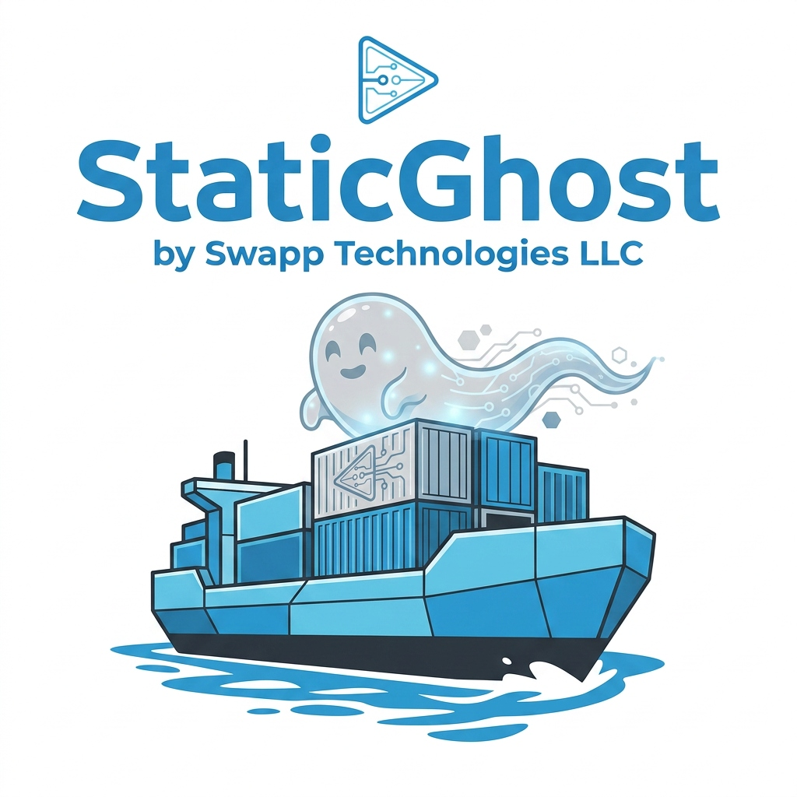

<div align="center">



# 👻 StaticGhost: Desktop Suite & Exporter

**A collaborative open-source creation by Swapp Technologies LLC & Google Antigravity AI**

[](https://swapptech.com)
[](https://deepmind.google)
[](https://buymeacoffee.com/swappTechOpenSource)
[](LICENSE)

<br/>

[](https://ghost.org)
[](https://electronjs.org)
[](https://nodejs.org)
[](https://docker.com)
[](https://cloudflare.com)
[](https://pages.github.com)
[](https://netlify.com)

</div>

---

> A modern Desktop application (built with Electron & Node.js) to manage local Ghost blogs per project, ingest custom main website designs, auto-tag affiliate links, encrypt protected posts, and deploy static HTML pages to **GitHub Pages, Netlify, Cloudflare Pages, Render, or Vercel for 100% free hosting**.

---

## 📑 Table of Contents

- [✨ Features](#-features)
- [📋 Prerequisites & System Requirements](#-prerequisites--system-requirements)
- [🛠️ Quick Start & Testing](#️-quick-start--testing)
- [🔑 First-Time Ghost Admin Setup (Mode A)](#-first-time-ghost-admin-setup-mode-a)
- [🎨 Design Ingestion & Custom `layout.html` Guide](#-design-ingestion--custom-layouthtml-guide)
- [💰 Affiliate Link Ingestion & Automation](#-affiliate-link-ingestion--automation)
- [💬 Giscus Comments Integration & Setup](#-giscus-comments-integration--setup)
- [✉️ Newsletter Subscriptions on a Static Blog](#️-newsletter-subscriptions-on-a-static-blog)
- [📝 Custom Signup, Contact & Beta Forms on Static Sites](#-custom-signup-contact--beta-forms-on-static-sites)
- [🌐 Deployment Architecture: Subfolder vs Subdomain](#-deployment-architecture-subfolder-vs-subdomain)
- [🔒 Security Architecture & Credentials Management](#-security-architecture--credentials-management)
- [🛡️ Security Disclaimer & Token Best Practices](#️-security-disclaimer--token-best-practices)
- [🤝 Standing on the Shoulders of Giants](#-standing-on-the-shoulders-of-giants)
- [💖 Giving Back to Open Source](#-giving-back-to-open-source)
- [📜 License & Collaboration](#-license--collaboration)

---

## ✨ Features

- **📂 Multi-Project Profiles**: Manage multiple independent project blogs (e.g. *Project A*, *Project B*) each with their own Docker container, volume, port, design layout, logo, and GitHub repository.
- **🐳 Mode A: Docker & Cloudflare Tunnel**: Run Ghost locally in a dedicated Docker container (`ghost:5-alpine`) with isolated persistent volumes, and manage files instantly via the built-in 1-click Web File Browser.
- **⚡ Mode B: Static HTML Exporter**: Convert Ghost posts into zero-cost, static HTML pages ready for GitHub Pages.
- **🎨 Custom Design & Logo Ingestion**: Import your main website's `layout.html` file so blog posts share your exact header, footer, navbar, logos, and CSS styling.
- **💰 Affiliate Link Automation**: Auto-tags product links (`amazon.com`, `bestbuy.com`, etc.) with `rel="sponsored nofollow noopener"` and `target="_blank"` for Google SEO compliance and link monetization tracking.
- **🔒 Build-Time AES-256 Password Protection**: Encrypts password-protected posts at export time. Unencrypted text is never exposed on GitHub Pages; visitors decrypt posts in-browser with a password prompt.
- **🔍 Pagefind Static Full-Text Search**: Builds an instant client-side search index (`/search/search-index.js`) without requiring a search server.
- **💬 Giscus GitHub Comments**: Embeds free GitHub Discussions commenting into static posts.
- **📡 RSS & Sitemap XML**: Automatically generates valid `rss.xml` and `sitemap.xml` files.
- **🚀 Multi-Cloud Publisher**: Deploy directly to GitHub Pages, Netlify, Cloudflare Pages, Render, or Vercel.

---

## 📋 Prerequisites & System Requirements

Before running the application, make sure you have the following installed on your machine:

| Tool | Required For | Required? | Download Link |
| :--- | :--- | :--- | :--- |
| **Node.js** (v18+) | Running the desktop application (`npm start`) | **Required** | [nodejs.org](https://nodejs.org) |
| **Git for Windows / Mac / Linux** | 1-Click Publishing to GitHub Pages | **Required** (for Mode B) | [git-scm.com](https://git-scm.com) |
| **GitHub Account** | Free static site hosting on GitHub Pages | **Required** (for Mode B) | [github.com](https://github.com) |
| **Docker Desktop** | Running local containerized Ghost instances per project | **Optional** (Only needed for Mode A local Ghost) | [docker.com](https://www.docker.com/products/docker-desktop/) |
| **Cloudflare CLI (`cloudflared`)** | Public HTTPS Tunnels for Mode A | **Optional** (Only for Mode A Tunnels) | [developers.cloudflare.com](https://developers.cloudflare.com/cloudflare-one/connections/connect-networks/downloads/) |
| **Netlify / Vercel / Render Account** | Alternative high-performance static hosting platforms | **Optional** (If not using GitHub Pages) | [netlify.com](https://netlify.com) / [vercel.com](https://vercel.com) / [render.com](https://render.com) |
| **Form Endpoint / Newsletter API Key** | Contact forms, newsletter subscriptions, Tally widgets | **Optional** (If using interactive newsletter/forms) | [formspree.io](https://formspree.io) / [buttondown.email](https://buttondown.email) |

---

## 🛠️ Quick Start & Testing

1. Clone the repository:
   ```bash
   git clone https://github.com/Swapp-Technologies-LLC/staticGhost.git
   cd staticGhost
   ```

2. Install dependencies:
   ```bash
   npm install
   ```

3. Run verification tests:
   ```bash
   npm test
   ```

4. Launch the Desktop GUI:
   ```bash
   npm start
   ```

---

## 🔑 First-Time Ghost Admin Setup (Mode A)

When running a local Ghost instance via **Mode A (Docker)**:

1. **Start the Container**: In the StaticGhost dashboard under **Mode A: Docker + Tunnel**, click **Start This Project Container**.
2. **Open Ghost Admin**: Open your web browser and navigate to:
   ```
   http://localhost:2368/ghost
   ```
   *(Replace `2368` with your project's allocated port if using a custom port).*
3. **Complete First-Time Setup**: Follow the on-screen Ghost setup wizard to create your admin account (email, password, and site title).
4. **Generate Content API Key** (Required for Mode B Exporter):
   - Inside Ghost Admin, navigate to **Settings (⚙️) ➔ Integrations**.
   - Scroll down to the bottom and click **+ Add custom integration**.
   - Name it (e.g. `StaticGhost`) and click **Create**.
   - Copy the generated **Content API Key** and paste it into the StaticGhost app under **Overview Connection Test** or **Mode B Exporter**.

---

## 🎨 Design Ingestion & Custom `layout.html` Guide

The **Design & Logo Ingestion Manager** lets you wrap raw Ghost article content inside your own website's design layout (header, footer, navbars, logos, and custom styles) during static exporting.

### 🏷️ Placeholder Comment Tags
Your custom `layout.html` file must contain these HTML comment tags where you want content to be injected dynamically:

| Placeholder Tag | Description | Typical Placement |
| :--- | :--- | :--- |
| `<!-- GHOST_PAGE_TITLE -->` | Replaced with the individual post's title. | Inside the `<title>` tag. |
| `<!-- GHOST_META_TAGS -->` | Replaced with automatically generated social OpenGraph cards, description, and analytics tracking code. | Inside the `<head>` block. |
| `<!-- GHOST_SITE_TITLE -->` | Replaced with the overall blog name. | Logo headers, navbar text, or footers. |
| `<!-- GHOST_CONTENT -->` | Replaced with the post body, author credentials, reading time calculation, and Giscus comments. | Inside the `<main>` wrapper. |

### 📄 Boilerplate Template Example
Below is a sample blueprint you can copy, save as `layout.html`, and upload to the desktop app:

```html
<!DOCTYPE html>
<html lang="en">
<head>
  <meta charset="UTF-8">
  <meta name="viewport" content="width=device-width, initial-scale=1.0">
  <title><!-- GHOST_PAGE_TITLE --></title>
  <!-- GHOST_META_TAGS -->
  <link rel="icon" type="image/x-icon" href="./favicon.ico">
  <link rel="icon" type="image/png" sizes="32x32" href="./favicon.png">
  <style>
    /* Add your custom website CSS styling here */
    body { font-family: sans-serif; background: #0f172a; color: #fff; margin: 0; }
    .container { max-width: 800px; margin: 2rem auto; padding: 0 1.5rem; }
    nav { padding: 1rem; border-bottom: 1px solid #334155; }
    a { color: #6366f1; }
  </style>
</head>
<body>
  <nav>
    <a href="./index.html"><strong><!-- GHOST_SITE_TITLE --></strong></a>
  </nav>
  <main class="container">
    <!-- GHOST_CONTENT -->
  </main>
</body>
</html>
```

---

## 💰 Affiliate Link Ingestion & Automation

To automate link monetization and maintain Google SEO compliance (preventing search rank penalties for paid/sponsored links):

### 📋 Expected Format
Under the **Affiliate Links & Tags** tab, enter a **comma-separated list** of target domains or subdomains:
```text
amazon.com, amzn.to, bestbuy.com, partnerstack.com
```
*Note: The app automatically splits names by commas and trims whitespace during export.*

### ⚙️ How It Works
When exporting static pages:
1. The builder scans all anchor links (`<a href="...">`) in your posts' HTML.
2. If the link's destination matches any domain in your list (e.g., `bestbuy.com`):
   - It appends or overwrites the link's `rel` attribute with:
     ```html
     rel="sponsored nofollow noopener"
     ```
   - It appends `target="_blank"` so the affiliate offer opens in a new tab without taking visitors away from your blog.
3. All other non-matching external or internal links are left completely untouched.

---

## 💬 Giscus Comments Integration & Setup

The static site exporter supports free, secure, and zero-database comments powered by [Giscus](https://giscus.app), which stores comments directly inside your repository's GitHub Discussions.

### 📋 Prerequisites & Setup on GitHub:
1. **Target Repository Requirements**:
   - The target GitHub repository must be **public** (private repositories do not support Giscus comments for anonymous/outside visitors).
   - The repository must have **Discussions** enabled. (Go to your repository **Settings ➔ General ➔ Features** and check the **Discussions** checkbox).
2. **Authorize Giscus App**:
   - Go to [github.com/apps/giscus](https://github.com/apps/giscus) and click **Install**.
   - Grant it access to your target blog repository.
3. **Configure input in the Desktop App**:
   - Enter your repository name in the format `Owner/Repository` (e.g. `username/my-blog-repo`) inside the **Giscus GitHub Comments Repo** input field.
   - When visitors load your static posts, a clean commenting interface will render automatically at the bottom, syncing discussion threads directly to GitHub!

---

## ✉️ Newsletter Subscriptions on a Static Blog

Because static sites (Mode B hosted on GitHub Pages) do not run a live database, you cannot use Ghost's native **Portal** membership signup form directly unless your Ghost instance is hosted publicly 24/7.

Instead, to collect email addresses and handle user newsletter subscriptions for free, we recommend embedding a third-party subscription form directly into your custom `layout.html` file:

### ⚙️ Recommended Setup:
1. **Choose a Newsletter Provider**: Sign up for an account with email marketing platforms like:
   - **[Buttondown](https://buttondown.email)** (minimalist, highly popular for developer/markdown blogs).
   - **[Beehiiv](https://www.beehiiv.com)** or **[Substack](https://substack.com)** (great for newsletters & writers).
   - **[ConvertKit](https://convertkit.com)** or **[Mailchimp](https://mailchimp.com)** (classic marketing tools).
2. **Retrieve the Embed Code**: In your newsletter provider's dashboard, navigate to **Integrations / Sharing** and copy their HTML form embed snippet.
3. **Insert into layout.html**: Paste the snippet inside your custom template file (e.g., in the footer or sidebar wrapper).
4. **Custom Forms (Advanced)**: If you prefer to code your own custom CSS form, use services like **[Formspree](https://formspree.io)** or **[Getform](https://getform.io)** to handle submission logic and route emails directly to Google Sheets or a webhook.

---

## 📝 Custom Signup, Contact & Beta Forms on Static Sites

If you want to add contact forms, user feedback inputs, or beta signup forms on your static blog without running a backend:

### 🎛️ App Automation: Form Action Auto-Redirector (Recommended)
Instead of editing form targets manually after each export, you can automate this directly in the Desktop App:
1. Go to the **Affiliate Links & Automation** tab in the sidebar.
2. Tick **Auto-redirect form actions to custom endpoint**.
3. Input your target URL (e.g. your Formspree form link or Buttondown endpoint).
During export, the suite automatically inspects your Ghost HTML posts, rewrites any `<form>` tags to direct submissions to your target URL, and enforces `method="POST"`.

### ⚡ Option A: Netlify Forms (Highly Recommended if using Netlify)
If your static site is hosted on Netlify, you can build plain HTML forms and collect responses directly in your Netlify dashboard with zero JS:
1. Write a standard HTML form.
2. Add the attribute `data-netlify="true"` to your `<form>` element:
   ```html
   <form name="beta-registration" method="POST" data-netlify="true">
     <input type="text" name="username" placeholder="Name" required>
     <input type="email" name="email" placeholder="Email" required>
     <button type="submit">Join Waitlist</button>
   </form>
   ```

### 🔌 Option B: External Form Endpoints (For GitHub Pages/Universal)
If hosting on GitHub Pages, use a serverless form endpoint to capture submissions:
1. Create a free account on **[Formspree.io](https://formspree.io)**, **[Getform.io](https://getform.io)**, or **[Basin](https://usebasin.com)**.
2. Paste the provided endpoint URL directly into your form's `action` attribute:
   ```html
   <form action="https://formspree.io/f/your-form-id" method="POST">
     <input type="email" name="email" placeholder="Enter email" required>
     <button type="submit">Submit</button>
   </form>
   ```

### 📋 Option C: Interactive Embeds
Use visual form creators like **[Tally.so](https://tally.so)**, **Google Forms**, or **Typeform** and paste their `<iframe>` widget codes directly into your posts.

---

## 🌐 Deployment Architecture: Subfolder vs Subdomain

When hosting a static blog alongside your main marketing website on platforms like GitHub Pages, we recommend the following structural layout:

### 1. Host the Blog in a Separate Repository (Recommended)
Always keep your static blog files in a **separate repository** (e.g. `my-blog-repo`) rather than merging it with your main website's codebase:
- **Clean Git Logs**: Re-generating static files, RSS feeds, and Pagefind search indexes creates high commit frequency. A separate repository prevents bloat in your core website's Git history.
- **Security & Scope**: Your Personal Access Tokens (PATs) or deployment credentials only need write permission for the blog repository, isolating security risks.
- **Build Efficiency**: Prevents your main website's build pipeline (e.g. Netlify/Vercel) from triggering useless deployments every time a post is exported.

### 2. Configure Subfolder (`example.com/blog`) vs Subdomain (`blog.example.com`)

- **Subfolder (`example.com/blog`) — Best for SEO (Recommended)**:
  - **SEO Benefit**: Directly consolidates search rank and domain authority under your main website. Backlinks to your blog posts automatically improve your core domain's SEO.
  - **GitHub Pages Setup**: Create a separate repository named **`blog`** under the exact same GitHub account/organization that controls your main site repository (which is mapped to custom domain `example.com`). GitHub Pages will natively resolve it at `example.com/blog` without requiring reverse proxies.
  - **Cross-Platform Setup (GitHub Pages Main + Netlify Blog)**: GitHub Pages cannot natively proxy subfolders to external hosts. If you host the main site on GitHub and the blog on Netlify (e.g. to use Netlify Forms), you must route your domain through **Cloudflare** and use a Cloudflare Worker to proxy `/blog/*` requests to your Netlify app. Alternatively, move **both** sites to Netlify and add a `_redirects` file to your main site to rewrite `/blog/*` to your blog project with a `200` status code (e.g. `/blog/* https://my-blog.netlify.app/:splat 200`).

- **Subdomain (`blog.example.com`) — Easiest Setup**:
  - **SEO Benefit**: Lower. Search engines treat subdomains as separate web properties, meaning you must build domain authority for the blog independently.
  - **GitHub Pages Setup**: Configure a custom CNAME DNS record for `blog` pointing to your user page (e.g. `username.github.io`) and save it under your repository settings.

---

## 🔒 Security Architecture & Credentials Management

The **StaticGhost Desktop Suite** is designed with security-first principles to keep your local credentials, database content, and publishing tokens completely safe:

### 1. OS-Level Credentials Encryption (At Rest)
Any sensitive credentials you enter into the application (such as your **GitHub Personal Access Tokens** and **Ghost API keys**) are encrypted before being saved to disk:
- **Windows**: Encrypted via the **Data Protection API (DPAPI)**, locking access specifically to your Windows user account.
- **macOS**: Encrypted via the native **macOS Keychain Services**.
Even if configuration files are copied or stolen, they cannot be decrypted on other computers or user accounts.

### 2. Sandbox Container & WSL Isolation
Your local Ghost databases and media files are stored inside isolated **Docker volumes** inside WSL 2 (Windows Subsystem for Linux):
- This isolates your blogging files from normal Windows user profiles, preventing desktop applications or scripting utilities from accessing your raw database directly.
- **Local Port Scoping**: Ports are bound to the loopback interface (`127.0.0.1`), preventing local network scanning or unauthorized access from other devices on the same Wi-Fi.

### 3. Edge Tunneling (Cloudflare Access Controls)
When exposing your local container via **Mode A Cloudflare Tunnels**, traffic is securely proxied:
- The Cloudflare tunnel creates an outbound connection to Cloudflare's edge servers.
- You do **not** need to open any incoming router ports or expose your home IP address, protecting your network from port scanners and DDOS attacks.

### 4. Double Opt-in Signup Validation
For newsletters or user registrations on your static website, double opt-in is enforced by default:
- Even if an unauthorized person had physical access to your keyboard or submitted inputs, they cannot finalize newsletter signup without direct access to the recipient's personal email inbox to click the verification links.

---

## 🛡️ Security Disclaimer & Token Best Practices

> [!WARNING]
> **Local Device & Credential Security**:
> - All saved access tokens are automatically encrypted on disk using your operating system's native keychain (`safeStorage` via Windows DPAPI / macOS Keychain / Linux Secret Service).
> - However, if an unauthorized 3rd party gains physical access or remote control of your unlocked local computer, stored credentials could potentially be accessed.
> - **Recommended Best Practice**: Always use **Fine-Grained Personal Access Tokens** (or SSH keys) scoped **strictly to the target blog repository** with minimum required permissions (`Contents: Read and write`). Never use account-wide admin tokens.

---

## 🤝 Standing on the Shoulders of Giants

This project is made possible thanks to the incredible open-source projects, tools, and platforms that form its foundation:

- **[Ghost Foundation](https://ghost.org)**: For building the world-class open-source Ghost CMS, Handlebars theme engine, and Content API.
- **[Electron](https://www.electronjs.org)** & **[Node.js](https://nodejs.org)**: For providing the cross-platform desktop application framework and runtime.
- **[Docker](https://www.docker.com)** & **[Cloudflare](https://www.cloudflare.com)**: For containerized local hosting and high-security edge tunneling (`cloudflared`).
- **[Pagefind](https://pagefind.app)**: For static client-side full-text search indexing with zero backend.
- **[Giscus](https://giscus.app)**: For powering free, zero-database blog comments via GitHub Discussions.
- **[GitHub Pages](https://pages.github.com)**, **[Netlify](https://netlify.com)**, **[Cloudflare Pages](https://pages.cloudflare.com)**, **[Render](https://render.com)** & **[Vercel](https://vercel.com)**: For providing generous, high-performance static hosting for developers worldwide.
- **[CryptoJS](https://github.com/brix/crypto-js)**: For client-side AES-256 cryptographic decryption.

---

## 💖 Giving Back to Open Source

We strongly believe in supporting the open-source ecosystem that makes this tool possible.

**20% of all sponsorship funds** received via GitHub Sponsors, Open Collective, and Buy Me a Coffee are automatically re-donated back to the **Ghost Foundation**, **Electron**, **Pagefind**, and our core open-source dependency maintainers!

---

## 📜 License & Collaboration

Created by **Swapp Technologies LLC** in collaboration with **Google Antigravity AI**.
Licensed under the [MIT License](LICENSE). Feel free to use, modify, and share!
